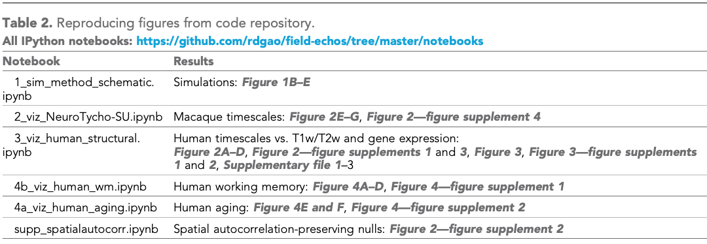

# field-echos
Project code for extracting neural population timescale from field potential data (LFP, ECoG, etc).

Paper is now published in eLife ([here][timescales_elife].)

    Gao, R., van den Brink, R. L., Pfeffer, T., & Voytek, B. (2020). Neuronal timescales are
    functionally dynamic and shaped by cortical microarchitecture. eLife, 9, e61277.

---
# Summary

**Neuronal timescales are functionally dynamic and shaped by cortical microarchitecture.**

In this project, we developed a method for measuring neuronal timescales from neural field potential data via [spectral parameterization][napp], and apply it to invasive ECoG data from humans and macaques. We find a gradient of neuronal timescales that increase from sensory/motor towards association brain regions, and further combine several other brain-wide structural, gene expression, and behavioral datasets to dissect the physiological factors that underly variations in timescale across the brain, as well as its change during behavior and aging.

---
# Data
This project uses several open datasets, thanks to the generosity and foresight of those that compile and share their data. See Table 1 in the paper for a list of all datasets used.

---
# Code
`./echo_utils.py` contains all the python helper functions used for subsequent analyses and visualizations.

`./scripts/` contains analysis scripts that compute and parameterize the PSDs in each ECoG database.

`./data/` contains intermediate data tables and diagnostic plots.

`./notebook/` contains Jupyter notebook that explains the project and paper in its entirety, and produces the figures seen in the publication. See Table 2 in the paper for the notebook-figure correspondence.

Surface projection of T1w/T2w and gene expression data is done using Rudy's repository [here][surface_proj].

[timescales_elife]:https://elifesciences.org/articles/61277
[napp]:https://github.com/fooof-tools/fooof
[surface_proj]:https://github.com/rudyvdbrink/Surface_projection/tree/v1.0.0
